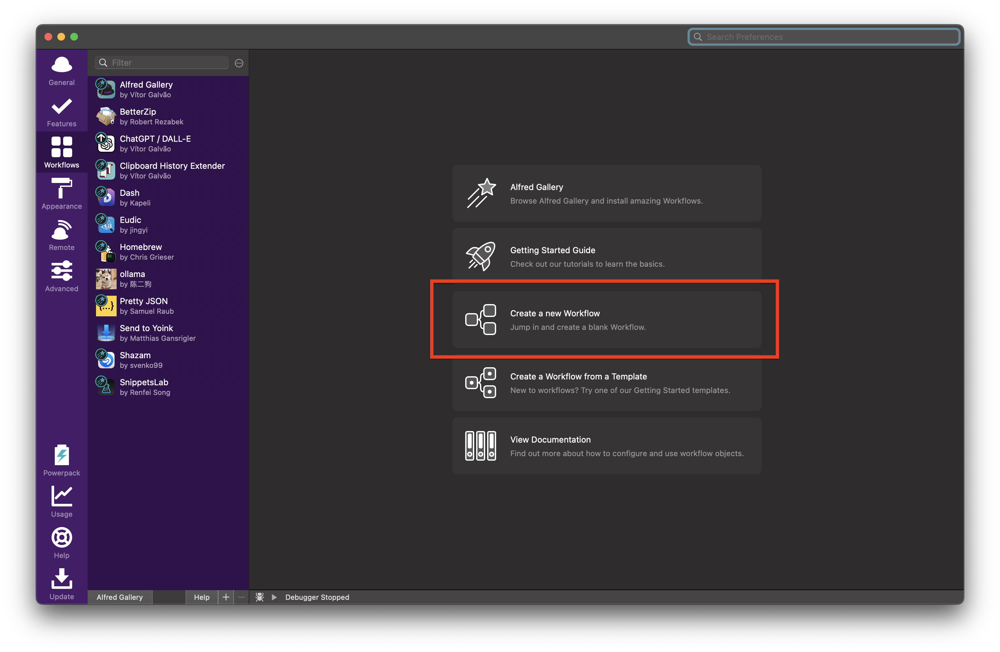
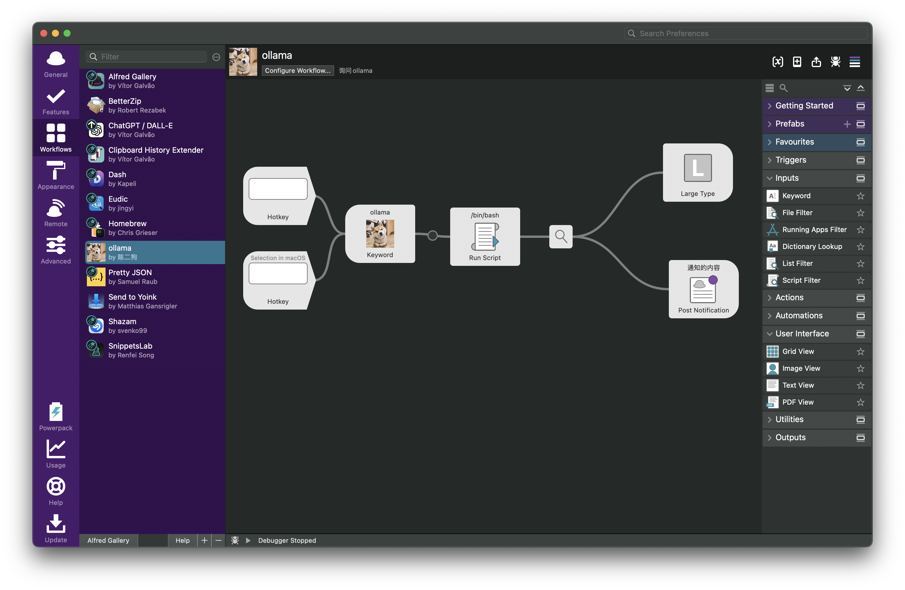
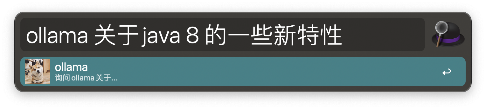

使用Alfred 整合 ollama 

​		最近在研究ollama ，就想到了是否能在alfred上使用ollama。网上找了一圈的资料，没有发现任何可用的alfred 对接ollama 的插件，于是乎，自己动手写了一个简易版本的插件。废话不多说，过程如下。

# 1、安装 ollama ，网上教程很多，就不详细说了，简单说一下重要的步骤。

​	 1.1、官网上下载对应的ollama版本，本人是mac，所以直接下载了mac版本的。

​	1.2、下载完成安装好之后，在终端(terminal)运行 ollama run llama3:latest 安装llama3模型(此处可以根据自己的需求安装不同的模型，可能不同的模型调用的接口和传递的参数不同，下面会用到)，，此处如果有安装llama3模型，则运行上面的命令会直接启动，之后可以直接在终端进行问答。

# 2、安装Alfred。这个就不说了，网上很多，还有，如果不常用Alfred 这个软件的话，也没必要看下面的内容了，不必浪费时间。

3、写一个 Alfred 的workflows，下面是具体的步骤

​	3.1、创建一个workflows

3.2、填写信息

3.3、上面的信息填完成之后，点击create。。

​	之后创建一个下面这种工作流

3.4、这里只说一下 RunScript这部分的内容，其他的节点都可以在右侧找到相应的组件，直接拖动到左侧，并用线连接起来就是了。

Run Script 中的代码如下 

query="{query}"

 	# 发送 POST 请求

response=$(curl -s -X "POST" "http://localhost:11434/api/chat" \
     -H 'Content-Type: application/json; charset=utf-8' \
     -d $'{
  "model": "llama3",
  "stream": false,
  "messages": [
    {
      "content": "'"${query}"',用中文回答",
      "role": "user"
    }
  ]
}')

​	# 检查 curl 命令是否成功

if [ $? -ne 0 ]; then
    content="发生异常：无法发送请求"
    echo $content
    exit 1
fi

​	# 提取所有 message.content

content=$(echo "$response" | grep -o '"content": *"[^"]*"' | sed 's/"content": *//g' | tr -d '"')

​	# 检查是否成功提取内容

if [ $? -ne 0 ]; then
    content="发生异常：无法提取内容"
    echo $content
    exit 1
fi

​	# 检查是否有返回内容

if [ -z "$content" ]; then
    content="发生异常：返回内容为空"
else
    echo -n $content
fi

将上面的代码复制到Run Script中，保存一下，直接就可以运行了。

##### 注意： 

##### 关键字自己可以随便定义，图片也可以自己随便创作。

##### 	在发起网络请求的时候，我只尝试过llama3大模型，没有试过其他的模型，不清楚其他的模型是不是也是这样调用接口的。

##### 有问题的可以联系本人

